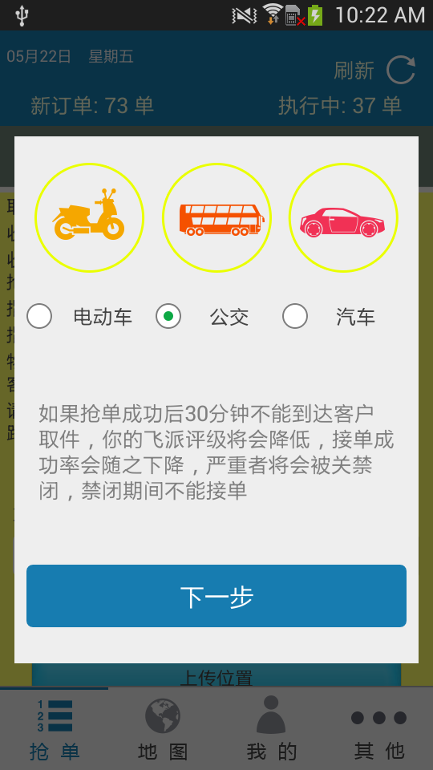
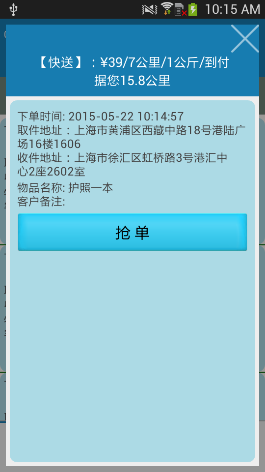

### Feipai
`feipai` android client<br>
this is `feipai` androdi client code,not include `setting` document,only a module

***
here is all that is required to get application working:<br>
run this module,you need configuration `settings.gradle`and`build.gradle`file,like this:<br>

`settings.gradle`
```gradle
include ':Feipai'
```
`build.gradle`
```gradle
// Top-level build file where you can add configuration options common to all sub-projects/modules.
buildscript {
    repositories {
        mavenCentral()
    }
    dependencies {
        classpath 'com.android.tools.build:gradle:0.12.2'
    }
}

allprojects {
    repositories {
        mavenCentral()
    }
}
```
---
###screetshot as beblow
- home page<br>
　  
　　
- invoke baidu map and select tranfic page.<br>
  　
  　　 
- location and ruborder page<br>.
   　
　 　
- my and other page<br>
  　
  　　　
